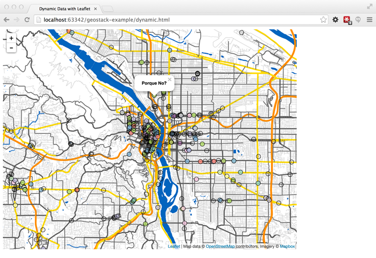

# geostack-map-pages

These are a quick & dirty pair of [Leaflet](http://leafletjs.com)-using html pages that are used in conjunction with my
[Let's Talk About Your Geostack](http://erictheise.github.io/deck-geo-stack-deep-dive) workshop & deck.

## Requirements

You should have successfully installed the companion repo, [geostack-api](https://github.com/erictheise/geostack-api),
and its requirements.

## Motivation

The workshop demonstrates how all components of a contemporary web mapping application can be run locally, on your own
computer, using open source software and open data. OpenStreetMap data is used with [TileMill](http://mapbox.com/tilemill/)
and [TileStream](https://github.com/mapbox/tilestream) to generate and serve map tiles as a base layer, and with
[Leaflet](http://leafletjs.com) to generate map overlays for points of interest.

`dynamic.html` consumes data from the `geostack-api` in order to create and display a Leaflet
[GeoJSON Layer](http://leafletjs.com/reference.html#geojson).



## Use

`static.html` and `dynamic.html` both rely on a running tileserver. You'd set up a
[TileStream](https://github.com/mapbox/tilestream) server in the [workshop](http://erictheise.github.io/deck-geo-stack-deep-dive),
so that's the default value for `tileUrl`. But you can also choose to use example tiles from MapBox, or tiles served
locally from a Python SimpleHTTPServer instance; just comment/uncomment `tileUrl` accordingly in this block, which
appears in both of the included `html` files.

```
// @todo: Pick a tileserver by uncommenting one of these values for tileUrl:
//
// To use the MapBox example tiles:
// tileUrl = 'https://{s}.tiles.mapbox.com/v3/{id}/{z}/{x}/{y}.png';
//
// To use the Python SimpleHTTPServer you've set up on port 8887:
// tileUrl = 'http://localhost:8887/tiles/{z}/{x}/{y}.png';
//
// To use the TileStream server you've set up on port 8888:
tileUrl = 'http://localhost:8888/v2/portland_from_osm/{z}/{x}/{y}.png';
//
```
